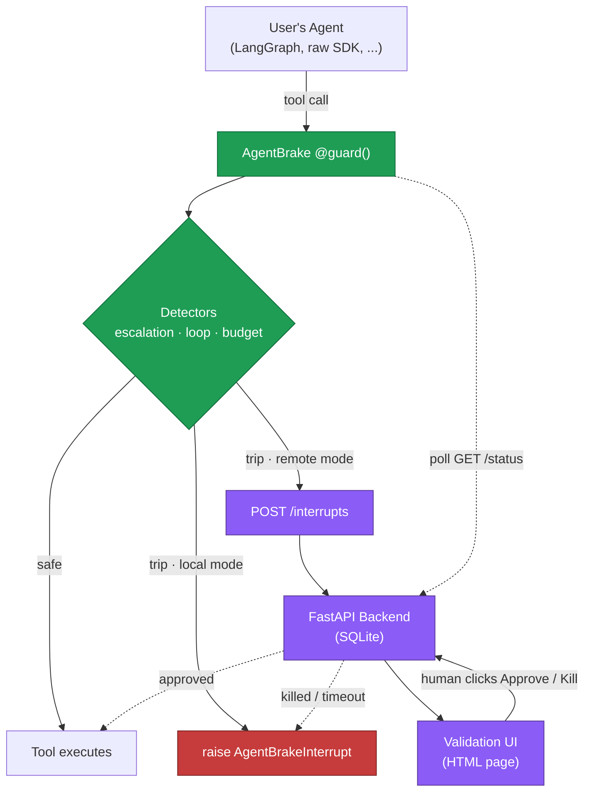

# AgentBrake

**A circuit breaker for LLM agents in production. Stop infinite loops, runaway costs, and privilege escalations in 3 lines of code.**

<p>
  
  
  <a href="https://github.com/BOSSMETALIQUE/agentbrake/actions"></a>
</p>

> **⚡ Status:** v0.0.2 — Local mode is stable (29/29 tests passing). LangGraph examples and remote mode UI work end-to-end. PyPI release coming soon. Looking for early users to validate the API.

## The problem

You ship an agent on Friday. Saturday morning you wake up to a $200 OpenAI bill because it spent the night calling `search("latest news")` in a loop after a tool returned a malformed response. Or your support bot, given a `tools` array a little too permissive, calls `delete_database` because a user prompt-injected it. Or it just retries the same failing call 50 times before giving up.

Observability tells you this happened. **AgentBrake stops it from happening.**

## Quick start

```bash
# Coming soon to PyPI. For now:
pip install git+https://github.com/BOSSMETALIQUE/agentbrake.git
```

```python
import agentbrake

agentbrake.init(
    allowed_tools=["search", "read_file"],
    budget_usd=5.0,
)

@agentbrake.guard()
def call_tool(name: str, args: dict):
    return my_tools[name](**args)
```

That's it. If your agent loops, blows the budget, or tries to call something outside the allowlist, `call_tool` raises `AgentBrakeInterrupt` 🛑 instead of executing.

For long-lived processes that launch many agent tasks, give each task its own isolated run — fresh budget, fresh call history, nothing leaks from one run to the next (runs in separate threads or asyncio tasks are isolated too):

```python
with agentbrake.run(budget_usd=5.0) as r:
    agent.invoke("task 1")   # guarded calls inside the block use this run

with agentbrake.run(budget_usd=5.0) as r:
    agent.invoke("task 2")   # fresh state — task 1's spend doesn't count here

print(r.state.total_cost_usd, len(r.state.calls))
```

Arguments omitted from `run()` are inherited from `init()`, so configure the allowlist once and open a cheap fresh run per task. Calling `init()` again also resets the default state.

Catch the interrupt to handle it gracefully:

```python
from agentbrake import AgentBrakeInterrupt

try:
    agent.run("do the thing")
except AgentBrakeInterrupt as e:
    print(f"Stopped: {e.reason}")  # LOOP, BUDGET, or ESCALATION
```

## What it detects

| Detector | What it catches | Example | Default behavior |
|---|---|---|---|
| **Loop** | 3 consecutive tool calls with the same name + structurally identical args | Agent repeatedly calls `search({"q": "weather"})` after a malformed response | Local: raise `AgentBrakeInterrupt(LOOP)` · Remote: request human validation |
| **Budget** | Cumulative cost exceeds the configured `budget_usd` ceiling | Long-running agent burns past its $5 cap overnight | Local: raise `AgentBrakeInterrupt(BUDGET)` · Remote: request human validation |
| **Escalation** | Tool name is not in the configured `allowed_tools` list | Agent tries to call `delete_database` when only `search` and `read_file` are allowed | Local: raise `AgentBrakeInterrupt(ESCALATION)` · Remote: request human validation |

## How it works

The `@guard()` decorator wraps your tool-dispatch function and keeps a per-run `RunState` (run id, total cost, full call history). Every call passes through three detectors in order — escalation → loop → budget — and any hit raises `AgentBrakeInterrupt` *before* the underlying tool runs. Loop detection uses a SHA-256 hash over the JSON-sorted `(name, args)` payload, so argument ordering doesn't fool it.

Every attempt is recorded **before** the tool executes (outcome `pending` → `ok` or `error`), so calls that raise still count toward loop detection and budget — an agent retrying the same failing call 50 times gets stopped just like one retrying a succeeding call.

Local mode is zero-config and runs entirely in-process. A remote mode (backend + human-in-the-loop validation UI) is on the roadmap.

## Architecture

AgentBrake ships in two modes — **local** (zero-config, in-process) and **remote** (backend + browser validation). The diagram below shows both paths through the same SDK.



The SDK is the only piece you import. In local mode (default), it raises on detection. In remote mode, it sends the interrupt context to the backend, prints a validation URL in the terminal, and polls for a human decision. Approve → the tool executes. Kill → `AgentBrakeInterrupt` is raised.

## Roadmap

- [x] Local mode SDK (loops, budget, escalation)
- [ ] LangChain integration examples
- [x] FastAPI backend with dynamic validation UI
- [ ] Slack / webhook integration for human-in-the-loop
- [ ] PyPI release

## Remote mode (human-in-the-loop)

Start the backend:

```bash
uvicorn agentbrake.server.main:app --reload --port 8000
```

The backend stores interrupts in a SQLite file named `agentbrake.db` in the directory you launch it from. Set the `AGENTBRAKE_DB` environment variable to use a different path.

Point the SDK at it:

```python
import agentbrake

agentbrake.init(
    allowed_tools=["search"],
    budget_usd=5.0,
    mode="remote",
    api_url="http://localhost:8000",
)

# Run the agent. If interrupted, the SDK will print a URL.
# A human can approve or kill the run from the browser.
```

When a detector trips, the SDK posts the interrupt to the backend, prints the validation URL in the terminal, and polls every 2 s until a human clicks Approve or Kill. Approve resumes the run as if nothing happened; Kill (or backend unreachable) raises `AgentBrakeInterrupt`.

## Why AgentBrake vs LangSmith / Helicone / AgentOps

Those tools are **observability** — they show you, after the fact, that your agent looped or overspent. AgentBrake is **enforcement** — it interrupts the agent mid-run, before the damage. The two are complementary: keep your dashboards, add a brake pedal.

## Development

```bash
git clone https://github.com/BOSSMETALIQUE/agentbrake.git
cd agentbrake
python -m venv .venv
.venv\Scripts\activate          # Windows
# source .venv/bin/activate     # macOS / Linux
pip install -e ".[dev]"
pytest
```

## Comparison

| Tool           | Approach                       | When it acts             | Self-hosted     |
|----------------|--------------------------------|--------------------------|-----------------|
| **AgentBrake** | Enforcement (circuit breaker)  | Before damage (mid-run)  | Yes (MIT)       |
| LangSmith      | Observability + guardrails     | After + during           | No (cloud)      |
| Helicone       | Observability + caching        | After                    | Yes (open core) |
| AgentOps       | Observability + replay         | After                    | No (cloud)      |

We don't compete with these — we complement them. Run AgentBrake as your last line of defense before the tool actually executes.

---

Built by [BOSSMETALIQUE](https://github.com/BOSSMETALIQUE). MIT License. Feedback welcome on GitHub Issues.
