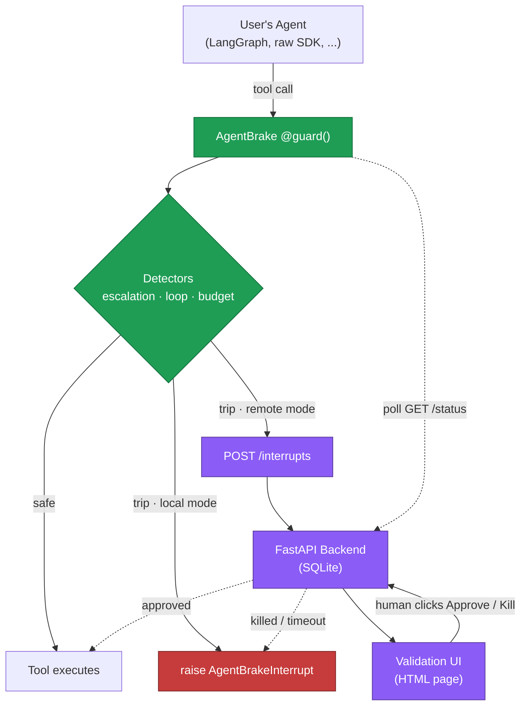

# AgentBrake

**A circuit breaker for LLM agents in production. Stop infinite loops, runaway costs, and privilege escalations in 3 lines of code.**

<p>
  
  
  <a href="https://github.com/BOSSMETALIQUE/agentbrake/actions"></a>
</p>

> **⚡ Status:** v0.1.0 — Local mode is stable (55/55 tests passing). Remote mode is secured with split SDK/approver secrets, and every human decision now produces a **signed, hash-chained receipt** (see [Verifiable receipts](#verifiable-receipts)). PyPI release coming soon. Looking for early users to validate the API.

## The problem

You ship an agent on Friday. Saturday morning you wake up to a $200 OpenAI bill because it spent the night calling `search("latest news")` in a loop after a tool returned a malformed response. Or your support bot, given a `tools` array a little too permissive, calls `delete_database` because a user prompt-injected it. Or it just retries the same failing call 50 times before giving up.

Observability tells you this happened. **AgentBrake stops it from happening.**

## Quick start

```bash
# Coming soon to PyPI. For now:
pip install git+https://github.com/BOSSMETALIQUE/agentbrake.git
```

```python
import agentbrake

agentbrake.init(
    allowed_tools=["search", "read_file"],
    budget_usd=5.0,
)

@agentbrake.guard()
def call_tool(name: str, args: dict):
    return my_tools[name](**args)
```

That's it. If your agent loops, blows the budget, or tries to call something outside the allowlist, `call_tool` raises `AgentBrakeInterrupt` 🛑 instead of executing.

For long-lived processes that launch many agent tasks, give each task its own isolated run — fresh budget, fresh call history, nothing leaks from one run to the next (runs in separate threads or asyncio tasks are isolated too):

```python
with agentbrake.run(budget_usd=5.0) as r:
    agent.invoke("task 1")   # guarded calls inside the block use this run

with agentbrake.run(budget_usd=5.0) as r:
    agent.invoke("task 2")   # fresh state — task 1's spend doesn't count here

print(r.state.total_cost_usd, len(r.state.calls))
```

Arguments omitted from `run()` are inherited from `init()`, so configure the allowlist once and open a cheap fresh run per task. Calling `init()` again also resets the default state.

Catch the interrupt to handle it gracefully:

```python
from agentbrake import AgentBrakeInterrupt

try:
    agent.run("do the thing")
except AgentBrakeInterrupt as e:
    print(f"Stopped: {e.reason}")  # LOOP, BUDGET, or ESCALATION
```

## What it detects

| Detector | What it catches | Example | Default behavior |
|---|---|---|---|
| **Loop** | 3 consecutive tool calls with the same name + structurally identical args | Agent repeatedly calls `search({"q": "weather"})` after a malformed response | Local: raise `AgentBrakeInterrupt(LOOP)` · Remote: request human validation |
| **Budget** | Cumulative cost exceeds the configured `budget_usd` ceiling | Long-running agent burns past its $5 cap overnight | Local: raise `AgentBrakeInterrupt(BUDGET)` · Remote: request human validation |
| **Escalation** | Tool name is not in the configured `allowed_tools` list | Agent tries to call `delete_database` when only `search` and `read_file` are allowed | Local: raise `AgentBrakeInterrupt(ESCALATION)` · Remote: request human validation |

## How it works

The `@guard()` decorator wraps your tool-dispatch function and keeps a per-run `RunState` (run id, total cost, full call history). Every call passes through three detectors in order — escalation → loop → budget — and any hit raises `AgentBrakeInterrupt` *before* the underlying tool runs. Loop detection uses a SHA-256 hash over the JSON-sorted `(name, args)` payload, so argument ordering doesn't fool it.

Every attempt is recorded **before** the tool executes (outcome `pending` → `ok` or `error`), so calls that raise still count toward loop detection and budget — an agent retrying the same failing call 50 times gets stopped just like one retrying a succeeding call.

Local mode is zero-config and runs entirely in-process. A remote mode (backend + human-in-the-loop validation UI) is on the roadmap.

## Architecture

AgentBrake ships in two modes — **local** (zero-config, in-process) and **remote** (backend + browser validation). The diagram below shows both paths through the same SDK.



The SDK is the only piece you import. In local mode (default), it raises on detection. In remote mode, it sends the interrupt context to the backend and polls for a human decision. Approve → the tool executes. Kill → `AgentBrakeInterrupt` is raised. The agent's process is never given the credential to approve its own interruption (see [Security model](#security-model-remote-mode)).

## Roadmap

- [x] Local mode SDK (loops, budget, escalation)
- [ ] LangChain integration examples
- [x] FastAPI backend with dynamic validation UI
- [x] Signed, hash-chained attestations (verifiable receipts)
- [ ] Slack / webhook integration for human-in-the-loop
- [ ] PyPI release

## Remote mode (human-in-the-loop)

Remote mode is protected by **two separate shared secrets**, because the guarded agent runs in the same process as the SDK. If the SDK could approve, the agent could approve itself — see [Security model](#security-model-remote-mode).

| Secret | Env var | Who holds it | Authorizes |
|---|---|---|---|
| **SDK secret** | `AGENTBRAKE_SDK_SECRET` | server **and** SDK | `POST /interrupts` (create), `GET /status` (poll) |
| **Approver secret** | `AGENTBRAKE_APPROVER_SECRET` | server **and** human only — *never* the SDK | `POST /decide` (approve / kill) |

Start the backend. If you don't set the secrets, it generates them and prints them to **its own console** (never to the SDK):

```bash
# Optional: set them explicitly. Otherwise the server generates + prints them.
export AGENTBRAKE_SDK_SECRET=shared-with-the-sdk
export AGENTBRAKE_APPROVER_SECRET=keep-this-private
uvicorn agentbrake.server.main:app --reload --port 8000
```

The backend stores interrupts in a SQLite file named `agentbrake.db` in the directory you launch it from. Set `AGENTBRAKE_DB` to use a different path.

Point the SDK at it — the SDK only needs the **SDK secret**:

```python
import os, agentbrake

os.environ["AGENTBRAKE_SDK_SECRET"] = "shared-with-the-sdk"  # or set in the shell

agentbrake.init(
    allowed_tools=["search"],
    budget_usd=5.0,
    mode="remote",
    api_url="http://localhost:8000",
)

# Run the agent. If interrupted, the SDK prints only:
#   "Interrupt <id> created; awaiting human decision (delivered out-of-band)."
# A human approves or kills the run from the browser using the approver secret.
```

When a detector trips, the SDK posts the interrupt (authenticated with the SDK secret) and polls every 2 s until a human decides. **The SDK does not print the validation URL** — the agent shares its process, so the URL is kept out of its reach and should be delivered out-of-band (Slack, email, PagerDuty). For local dev, set `AGENTBRAKE_SHOW_URL=1` to print it to stderr.

To approve, open the interrupt in a browser and enter the approver secret (or open `…/interrupts/<id>?token=<approver-secret>`). Approve resumes the run as if nothing happened; Kill, an invalid/absent approver secret, or an unreachable backend all stop the run with `AgentBrakeInterrupt`.

### Security model (remote mode)

The threat: an agent with an HTTP tool (`requests`, `fetch`, a browser tool) and enough autonomy to be dangerous is exactly the agent that might try to clear its own interruption. The SDK runs inside that agent's process, so anything the SDK knows, the agent can potentially reach.

AgentBrake closes this with a privilege split:

- **The SDK can create and poll, but never approve.** `/decide` requires the *approver* secret, which the SDK process never receives. The `AgentBrakeClient` holds only the SDK secret and exposes no `approve`/`decide` method.
- **`/interrupts` and `/status` require the SDK secret**, so a stranger who finds the URL can't forge interrupt records or enumerate runs.
- **The validation page never embeds the approver secret.** The agent knows the interrupt id and can `GET` the HTML page, so the secret is supplied by the human (typed, or read client-side from a `?token=` link) and is never rendered into the page server-side.
- **Fail closed.** If the backend is unreachable or rejects the SDK, the run stops rather than continuing unguarded.

## Verifiable receipts

Stopping an agent is enforcement. *Proving* what a human decided — on what information, at what time — is accountability. As of v0.1.0, every approve/kill decision produces a **signed, tamper-evident attestation**: a receipt you can hand to an auditor, a regulator, or your future self.

When a human decides, the server mints an attestation and appends it to a hash-chained log:

```json
{
  "version": "1",
  "seq": 7,
  "interrupt_id": "…",
  "run_id": "…",
  "agent_id": "support-bot-prod",
  "decision": "kill",
  "reason": "escalation",
  "tool": "delete_database",
  "tool_args_digest": "sha256:…",   // digest of the tool call, never the raw args
  "created_at": "2026-06-15T12:00:00+00:00",
  "decided_at": "2026-06-15T12:00:18+00:00",
  "pending_seconds": 18.0,
  "info_digest": "sha256:…",        // digest of exactly what the approver was shown
  "info_summary": { "tool": "delete_database", "total_cost_usd": 0.07, "num_calls": 4 },
  "prev_hash": "…"                  // entry hash of attestation #6
}
```

Two layers of tamper-evidence:

- **Per-record signature.** Each attestation is signed with HMAC-SHA256 under a server-side key (`AGENTBRAKE_SIGNING_KEY`, or generated and printed in the server banner on startup). Alter any field and the signature no longer verifies — and you can't forge a new signature without the key.
- **Hash chain.** Each attestation embeds `prev_hash`, the entry hash of the one before it. You can't delete or reorder an entry without breaking the next link, and the monotonic `seq` makes a missing entry show up as a gap. The first entry chains to a fixed genesis hash.

Only digests of the tool call and the displayed info are stored — never raw arguments — so a receipt is safe to expose while still binding the decision to exactly what was acted on.

### Endpoints

| Endpoint | Returns |
|---|---|
| `GET /attestations/{interrupt_id}` | The signed receipt for one interrupt, with a `signature_valid` flag |
| `GET /attestations` | The full chain plus a `verified` integrity verdict |
| `GET /attestations/verify` | `{ ok, count, error }` — verifies the whole chain |

These read-only endpoints are unauthenticated by design: a proof is meant to be independently verifiable. Verifying a signature requires the signing key, which never leaves the server, so set `AGENTBRAKE_SIGNING_KEY` to a stable value if you want receipts to stay verifiable across restarts.

```python
from agentbrake.server import store, attest

ok, error = attest.verify_chain(store.get_attestation_chain())
assert ok, error
```

## Why AgentBrake vs LangSmith / Helicone / AgentOps

Those tools are **observability** — they show you, after the fact, that your agent looped or overspent. AgentBrake is **enforcement** — it interrupts the agent mid-run, before the damage. The two are complementary: keep your dashboards, add a brake pedal.

## Development

```bash
git clone https://github.com/BOSSMETALIQUE/agentbrake.git
cd agentbrake
python -m venv .venv
.venv\Scripts\activate          # Windows
# source .venv/bin/activate     # macOS / Linux
pip install -e ".[dev]"
pytest
```

## Comparison

| Tool           | Approach                       | When it acts             | Self-hosted     |
|----------------|--------------------------------|--------------------------|-----------------|
| **AgentBrake** | Enforcement (circuit breaker)  | Before damage (mid-run)  | Yes (MIT)       |
| LangSmith      | Observability + guardrails     | After + during           | No (cloud)      |
| Helicone       | Observability + caching        | After                    | Yes (open core) |
| AgentOps       | Observability + replay         | After                    | No (cloud)      |

We don't compete with these — we complement them. Run AgentBrake as your last line of defense before the tool actually executes.

---

Built by [BOSSMETALIQUE](https://github.com/BOSSMETALIQUE). MIT License. Feedback welcome on GitHub Issues.
